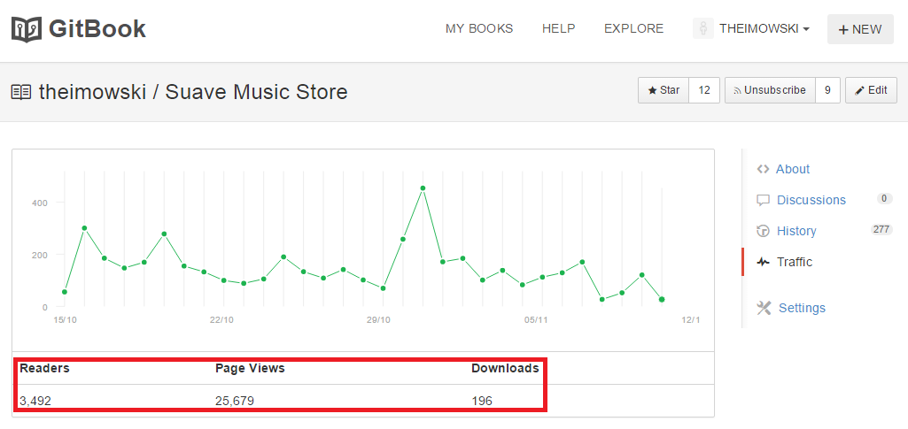
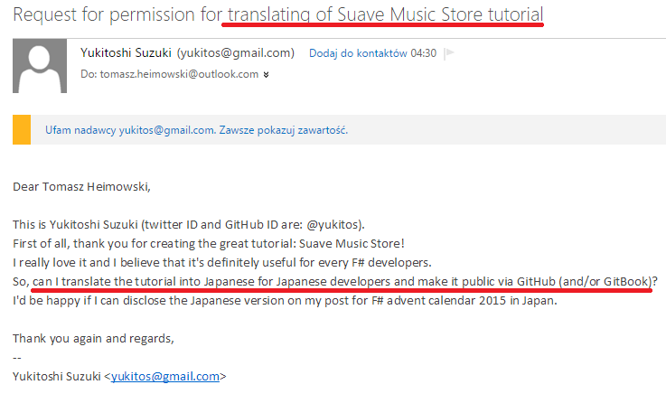

- title : Obrona Pracy Magisterskiej
- description : Wykorzystanie programowania funkcyjnego w tworzeniu aplikacji biznesowych
- author : Tomasz Heimowski
- theme : night
- transition : default
- language: polish

***

## Praca dyplomowa

### Tomasz Heimowski
#### Application of functional programming to business applications development
#### Wykorzystywanie programowania funkcyjnego w tworzeniu aplikacji biznesowych

opiekun pracy: dr inż. Krzysztof Manuszewski

*** 

## Plan prezentacji

1. Temat pracy
2. Zrealizowane zadania
3. Rezultaty, wnioski, dalsze prace

***

## Temat pracy

* Poznanie języka programownia F# (FSharp)
* Zainteresowanie paradygmatem funkcyjnym
* Udzielenie się w społeczności F# poprzez samouczek
* Wola, aby włożona praca nie poszła w zapomnienie
* Wspólne dopracowanie tematu z opiekunem pracy

***

## Zrealizowane zadania

1. Aplikacja internetowa
2. Samouczek
3. Praca dyplomowa

---

## Aplikacja internetowa

* Bazuje na aplikacji napisanej przez zespół ASP.NET MVC
http://www.asp.net/mvc/overview/older-versions/mvc-music-store/mvc-music-store-part-1
* Music Store - muzyczny sklep internetowy
* Nieskomplikowane funkcjonalności
* Adresuje znane problemy *"web development"*

---

## Samouczek

* Napisany w języku angielskim
* Również bazuje na samouczku zespołu ASP.NET MVC
* Uczy jak wytworzyć aplikację internetową w języku F# przy zastosowaniu różnych mechanizmów funkcyjnych
* Wymienia zalety płynące z programowania funkcyjnego
* Opublikowany na witrynie GitBook
https://www.gitbook.com/book/theimowski/suave-music-store

---

## Praca dyplomowa

* Napisana w języku angielskim
* Omawia pojęcie paradygmatu programowania i opisuje kilka najpopularniejszych paradygmatów
* Przedstawia podejście funkcyjne i jego założenia
* Pokazuje jak obecnie języki funkcyjne są wykorzystywane w przemyśle oprogramowania
* Poprzez odniesienie się do najważniejszych części samouczka, przedstawia proces wytworzenia aplikacji biznesowej w tym podejściu

***

## Rezultaty, wnioski, dalsze prace

---

## Twitter

---

## GitBook

---

## Slack - #fsharp channel

---

## Japanese version?

---

## Wnioski

* Udzielenie się w społeczności F# - cel osiągnięty
* Włożony wysiłek nie poszedł w zapomnienie - cel osiągnięty
* Zastosowanie paradygmatu funkcyjnego w oprogramowaniu biznesowym niesie za sobą wiele zalet - a napisana praca dyplomowa ma o tym przekonać

---

## Kontynuacja prac

* Zainteresowanie obszarem aplikacji internetowych w F#
* Framework "Freya"
* Propozycja "stosu technologicznego" X-Platform
    * Linux
    * CoreCLR
    * Docker
    * F#
    * Suave

***