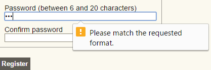
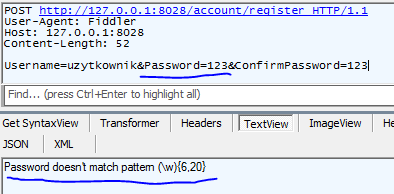
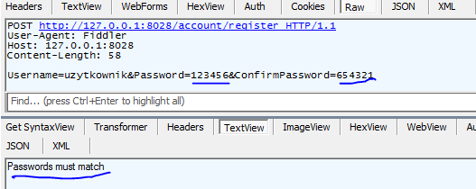

- title : Seminarium dyplomowe
- description : Wykorzystanie programowania funkcyjnego w tworzeniu aplikacji biznesowych
- author : Tomasz Heimowski
- theme : night
- transition : default
- language: polish

***

## Praca dyplomowa

- Generates [reveal.js](http://lab.hakim.se/reveal-js/#/) presentation from [markdown](http://daringfireball.net/projects/markdown/)
- Utilizes [FSharp.Formatting](https://github.com/tpetricek/FSharp.Formatting) for markdown parsing
- Get it from [http://fsprojects.github.io/FsReveal/](http://fsprojects.github.io/FsReveal/)
- Tomasz Heimowski
- temat pracy: *Wykorzystanie programowania funkcyjnego w tworzeniu aplikacji biznesowych*
- opiekun pracy: dr inż. Krzysztof Manuszewski

***

## Plan drugiej prezentacji

1. Krótkie przypomnienie co było na pierwszej prezentacji
2. Omówienie postępów
3. Demonstracja postępów; **Funkcjonalność formularzy**
4. Plany na najbliższy czas
5. **Podstawy programowania funkcyjnego**
6. Rzeczywisty przykład - Paradygmat imperatywny vs. funkcyjny

***

## Przypomnienie

### (pierwsza prezentacja)

- zainteresowanie się językiem F#
- pomysł na pracę magisterską
- zadania do realizacji
    - aplikacja internetowa
    - samouczek
    - praca dyplomowa
- dlaczego taki temat

***

## Postępy

### (pierwsza prezentacja)

- Wymyślenie tematu oraz zaplanowanie przebiegu pracy dyplomowej
- Nawiązanie kontaktu ze społecznością F#,
- W szczególności z członkami fundacji fsharp.org odpowiedzialnymi za technologie internetowe
- Niekompletna implementacja aplikacji internetowej

---

## Postępy

### (od czasu pierwszej prezentacji)

- Dokończenie implementacji aplikacji internetowej (prawie)
- Wstępny przegląd kodu przez twórców Suave.IO
- Napisanie funkcjonalności formularzy
    - walidacja pól po stronie serwera oraz klienta (HTML5)
- Częściowe uporządkowanie kodu

***

## Demo aplikacji internetowej

***

## Formularze

- aplikacja internetowa wykorzystuje formularze w kilku miejscach
- układ tych formularzy jest jednorodny
- gotowe funkcje w Suave.IO
    - do odczytania danych z formularza
    - do tworzenia znaczników HTML

---

## Formularze

Mój pomysł na wygodną pracę z formularzami

    [lang=fs]
    type Register = {                   // definicja typu reprezentującego formularz rejestracji
        Username : string               // wymagane pole
        Email : Email option            // opcjonalne pole, typ "Email" zapewnia prawidłową wartość
        Password : string               // wymagane pole
        ConfirmPassword : string        // wymagane pole
    }

    let pattern = @"(\w){6,20}"         // wyrażenie regularne dla hasła - od 6 do 20 znakow

    let passwordsMatch f =              // walidacja po stronie serwera - hasła muszą się zgadzać
        f.Password = f.ConfirmPassword, 
        "Passwords must match"

    let register : Form<Register> =     // defincja formularza bazującego na typie "Register"
        Form ([ 
            StringProp ((fun f -> <@ f.Username @>), 
                        [ maxLength 30 ] )                  // nazwa użytkownika - max 30 znakow
            StringProp ((fun f -> <@ f.Password @>), 
                        [ matches pattern ] )               // hasło - musi spełniać wyrażenie reg.
            StringProp ((fun f -> <@ f.ConfirmPassword @>), 
                        [ matches pattern ] )               // potwierdzenie hasła - jak wyżej
                ],[ passwordsMatch ])                       // walidacja tylko po stronie serwera

---

## Formularze
### Generowanie znaczników HTML 

    [lang=fs]
    form [
        fieldset [
            legend "Rejestracja"
                div [
                    text "Nazwa użytkownika"
                ]   
                div [
                    textInput Form.register (fun f -> <@ f.Username @>) []
                ]

                div [
                    text "Hasło (od 6 do 20 znakow)"
                ]   
                div [
                    passwordInput Form.register (fun f -> <@ f.Password @>) []
                ]
        ]

        submitInput "Rejestruj"
    ]
---

## Formularze
### Silnie typowane pola formularzy

    [lang=fs]
    type Register = {
        Username : string
        Email : Email option
        Password : string
        ConfirmPassword : string
    }

    let handler (form : Register) =
        let username : string = 
            form.Username                           // OK - typ "string"
        let password : HashedPassword =
            form.Password                           // Błąd kompilacji - inne typy

        Database.saveUser(username, password)

---

## Formularze
### Obsługa pól wymaganych / opcjonalnych

    [lang=fs]
    type Register = {
        Username : string
        Email : Email option
        Password : string
        ConfirmPassword : string
    }

    let handler (form : Register) =
        match form.Email with                 // pole "Email" jest opcjonalne
        | Some email ->                       // jeśli użytkownik je wypełnił
            sendEmail(form.Username, email)   // wyślij mu maila
        | None ->                             // a w przeciwnym wypadku
            ()                                // nic nie rob

---

## Formularze 
### Walidacja pojedynczego pola

#### Jedna definicja walidacji

    [lang=fs]
    let register : Form<Register> = 
        Form ([ StringProp ((fun f -> <@ f.Username @>), [ maxLength 30 ] )
                StringProp ((fun f -> <@ f.Password @>), [ matches pattern ] )
                StringProp ((fun f -> <@ f.ConfirmPassword @>), [ matches pattern ] )
                ],[ passwordsMatch ])

---

#### Obsługa po dwóch stronach

Po stronie klienta (HTML5)

    [lang=html]
    <input name="Password" type="password" required="" pattern="(\w){6,20}">

Po stronie serwera

---

## Formularze 
### Własne walidacje po stronie serwerowej

    [lang=fs]
    let passwordsMatch f = 
        f.Password = f.ConfirmPassword, "Passwords must match"

    let register : Form<Register> = 
        Form ([ StringProp ((fun f -> <@ f.Username @>), [ maxLength 30 ] )
                StringProp ((fun f -> <@ f.Password @>), [ matches pattern ] )
                StringProp ((fun f -> <@ f.ConfirmPassword @>), [ matches pattern ] )
                ],[ passwordsMatch ])

---

## Formularze
### Podsumowanie

- przejrzysty, deklaratywny sposób definiowania formularzy
- proste generowanie znaczników HTML dla pól formularzy
- silnie typowane pola formularzy
- obsługa pól wymaganych / opcjonalnych
- proste walidacje pojedynczego pola
    - strona kliencka (HTML5)
    - strona serwerowa
- możliwość definiowania własnych walidacji po stronie serwerowej

***

## Plany na najbliższy czas

- Dopracowanie szczegółów funkcjonalnych
- Ostateczne uporządkowanie kodu
- Szczegółowy przegląd kodu przez specjalistów
- Rozpoczęcie pisania samouczka

***

## Podstawy programowania funkcyjnego

### niezmienność

- Wartość raz przypisana do symbolu, nie może się zmienić w trakcie działania programu
- W rezultacie nie istnieje koncept "zmiennych"
- Z początku może się wydawać to ograniczeniem
- W praktyce, niezmienność okazuje się być zaletą

---

#### Tradycyjne podejście ze zmienną - C#

    [lang=cs]
    int x = 10;
    x = x * 5;
    x = x + 3;

#### To samo, bez zmiennych - C#

    [lang=cs]
    int x = 10;
    int x2 = x * 5;
    int x3 = y + 3;

---

## Podstawy programowania funkcyjnego

### rekurencja

Skoro nie możemy mieć zmiennych, jak napisać funkcję liczącą sumę liczb z zadanego zakresu?

#### Sumowanie liczb - C# imperatywnie

    [lang=cs]
    int SumNumbers(int start, int end)
    {
        int sum = 0;
        for (int i = start; i <= end; i = i+1)
        {
            sum = sum + i;
        }
        return sum;
    }

---

#### Sumowanie liczb - C# rekurencja

    [lang=cs]
    int SumNumbers(int start, int stop)
    {
        if (start > stop) 
        {
            return 0;
        }
        else 
        {
            return start + SumNumbers(start + 1, stop);
        }
    }

#### Sumowanie liczb - F# rekurencja

    [lang=fs]
    let sumNumbers start stop =
        if start > stop then 
            0
        else
            start + sumNumbers (start + 1) stop

---

#### Haskell
 
    [lang=haskell]
    recur_count k = 1 : 1 : 
        zipWith recurAdd (recur_count k) (tail (recur_count k))
            where recurAdd x y = k * x + y
## Podstawy programowania funkcyjnego

### funkcje wyższego rzędu

Funkcja, która jako swój argument przyjmuje inną funkcję

---

    [lang=fs]
    let numbers = [ 1 .. 10 ]
    let isOdd n = n % 2 = 1
    let square n = n * n

    // val numbers : int list
    // val isOdd : int -> bool
    // val square : int -> int

    List.filter isOdd numbers
    // val it : int list = [1; 3; 5; 7; 9]
    
    List.map square (List.filter isOdd numbers)
    // val it : int list = [1; 9; 25; 49; 81]

---

### C/AL

    [lang=cal]
    PROCEDURE FizzBuzz(n : Integer) r_Text : Text[1024];
    VAR
      l_Text : Text[1024];
    BEGIN
      r_Text := '';
      l_Text := FORMAT(n);

      IF (n MOD 3 = 0) OR (STRPOS(l_Text,'3') > 0) THEN
        r_Text := 'Fizz';
      IF (n MOD 5 = 0) OR (STRPOS(l_Text,'5') > 0) THEN
        r_Text := r_Text + 'Buzz';
      IF r_Text = '' THEN
        r_Text := l_Text;
    END;

Real-World Functional Programming

Tomas Petricek with Jon Skeet

http://www.manning.com/petricek/

***

## Paradygmat imperatywny vs. funkcyjny

### Separation of concerns

### Rozdzielenie zagadnień

https://twitter.com/mariofusco/status/571999216039542784

---

